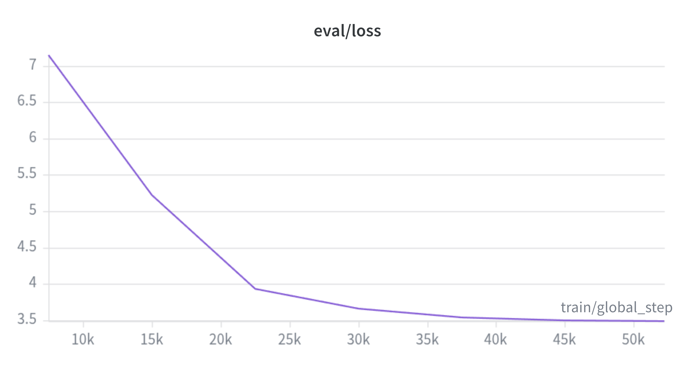
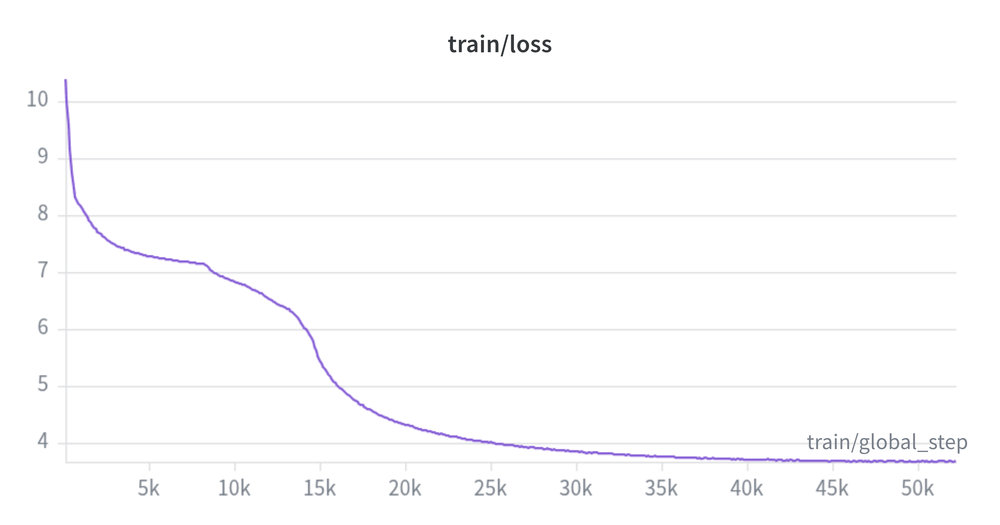

---
language:
- si
license: apache-2.0
tags:
- bert
- masked-language-modeling
- sinhala
- nlp
- pretraining
pipeline_tag: fill-mask
---

# HelaBERT

HelaBERT is a BERT-based masked language model pre-trained from scratch on a large Sinhala text corpus. It is designed to produce contextual representations of Sinhala language text and can be used for downstream NLP tasks such as text classification, named entity recognition, semantic similarity, and information retrieval.

---

## Model Details

| Property | Value |
|---|---|
| **Architecture** | BERT (encoder-only) |
| **Vocabulary size** | 32,000 |
| **Hidden size** | 384 |
| **Transformer layers** | 6 |
| **Attention heads** | 6 |
| **Intermediate size** | 1,536 |
| **Max sequence length** | 512 |
| **Activation function** | GELU |
| **Tokenizer** | SentencePiece Unigram |
| **Pre-training objective** | Masked Language Modeling (MLM) |

---

## Training Data

HelaBERT was pre-trained on approximately **1.1 billion tokens** (~26.5 million lines) of Sinhala text sourced from three datasets:

- **MADLAD-400** — Sinhala subset of the multilingual document-level dataset
- **CulturaX** — Sinhala subset of the cleaned multilingual web corpus
- **Custom Sinhala Corpus** — A dataset compiled from Sinhala Wikipedia, Sinhala news articles, and Sinhala web crawl data

### Data Preprocessing

The raw text was preprocessed through a multi-stage cleaning pipeline before training:

- Unicode NFC normalization and removal of zero-width characters (excluding ZWJ U+200D, which is required for correct Sinhala ligature rendering)
- Filtering to retain only lines containing Sinhala characters (U+0D80–U+0DFF), with a minimum line length of 5 characters
- Removal of non-Sinhala characters, retaining Sinhala script, digits, common punctuation, and ZWJ/ZWNJ
- Normalization of repeated punctuation, extra whitespace, unmatched brackets, and date-like numeric patterns
- Final text was combined into a single corpus and tokenized using a SentencePiece unigram tokenizer

---

## Tokenizer

HelaBERT uses a **SentencePiece Unigram** tokenizer trained on Sinhala text with a vocabulary size of 32,000. The tokenizer is not included in the HuggingFace tokenizer format and must be used via the `sentencepiece` library directly.

```python
import sentencepiece as spm

sp = spm.SentencePieceProcessor()
sp.load("tokenizer/unigram_32000_0.9995.model")

ids = sp.encode("ශ්‍රී ලංකාවේ අගනුවර කොළඹ වේ", out_type=int)
```

---

## Training Configuration

| Hyperparameter | Value |
|---|---|
| **Training files used** | 800 / 922 tokenized chunk files |
| **Sequence length** | 256 (sliding window, stride 128) |
| **Total training samples** | ~7.4 million |
| **Train / Validation split** | 90% / 10% |
| **MLM probability** | 15% (80% mask, 10% random, 10% unchanged) |
| **Per-device batch size** | 32 |
| **Gradient accumulation steps** | 8 |
| **Effective batch size** | 256 |
| **Learning rate** | 1e-4 |
| **LR scheduler** | Cosine |
| **Warmup ratio** | 5% |
| **Weight decay** | 0.01 |
| **Epochs** | 2 |
| **Precision** | FP16 |
| **Framework** | HuggingFace Transformers + PyTorch |

---

## Training Results

Training loss decreased from ~10.0 to ~3.5 over 2 epochs (~52,000 steps), with validation loss converging in parallel from ~7.0 to ~3.5, indicating no significant overfitting.




| Metric | Value |
|---|---|
| **Final train loss** | 3.69 |
| **Final eval loss** | 3.49 |
| **Total training steps** | ~52,000 |

---

## Hardware & Environmental Impact

| Property | Details |
|---|---|
| **CPU** | Intel Core i9-14900HX (24 cores / 32 threads) |
| **RAM** | 64 GB DDR5 5600 MHz |
| **GPU** | NVIDIA GeForce RTX 4060 8 GB GDDR6 |
| **GPU TDP** | 55 W |
| **OS** | Arch Linux (kernel 6.18.9, x86_64) |
| **Training duration** | ~16 hours |

**CO₂ Estimate:** `0.055 kW × 16 h × 0.510 kg CO₂/kWh ≈ 0.45 kg CO₂eq`

Grid carbon intensity for Sri Lanka sourced from [Our World in Data](https://ourworldindata.org/grapher/carbon-intensity-electricity) (~0.510 kg CO₂/kWh). This estimate covers GPU power draw only and does not account for CPU, RAM, or system-level power consumption, so the actual footprint is moderately higher.

---

## Usage

### Masked Language Modeling (Fill-Mask)

```python
from transformers import BertForMaskedLM
import sentencepiece as spm
import torch

sp = spm.SentencePieceProcessor()
sp.load("tokenizer/unigram_32000_0.9995.model")

model = BertForMaskedLM.from_pretrained("HelaBERT")
model.eval()

sentence = "ශ්‍රී ලංකාවේ අගනුවර කොළඹ වේ"
mask_id = sp.piece_to_id("[MASK]")

parts = sentence.split("[MASK]")
input_ids = sp.encode(parts[0], out_type=int) + [mask_id] + sp.encode(parts[1], out_type=int)
input_ids = torch.tensor([input_ids])

with torch.no_grad():
    logits = model(input_ids).logits

mask_index = (input_ids == mask_id).nonzero(as_tuple=True)[1]
top5 = torch.topk(logits[0, mask_index], 5, dim=-1)

for token_id in top5.indices[0]:
    print(sp.id_to_piece(token_id.item()))
```

### Sentence Embeddings

```python
from transformers import BertModel
import sentencepiece as spm
import torch

sp = spm.SentencePieceProcessor()
sp.load("tokenizer/unigram_32000_0.9995.model")

model = BertModel.from_pretrained("HelaBERT", add_pooling_layer=False)
model.eval()

def embed(text):
    ids = torch.tensor([sp.encode(text, out_type=int)])
    mask = (ids != sp.pad_id()).unsqueeze(-1)
    with torch.no_grad():
        out = model(ids)
    return ((out.last_hidden_state * mask).sum(dim=1) / mask.sum(dim=1)).squeeze(0)

embedding = embed("කෘත්‍රිම බුද්ධිය ශ්‍රී ලංකාවේ අනාගතය වෙනස් කරයි")
print(embedding.shape)  # torch.Size([384])
```

### Semantic Similarity

```python
import torch.nn.functional as F

e1 = embed("කෘත්‍රිම බුද්ධිය අනාගතය වෙනස් කරයි")
e2 = embed("කෘත්‍රිම බුද්ධිය අනාගතයට බලපායි")

score = F.cosine_similarity(e1, e2, dim=0)
print(f"Similarity: {score.item():.4f}")  # ~0.78
```

**Similarity score interpretation:**

| Score | Interpretation |
|---|---|
| 0.80 – 1.00 | Very similar meaning |
| 0.60 – 0.80 | Related / paraphrase |
| 0.40 – 0.60 | Weakly related |
| < 0.40 | Different meaning |

---

## Limitations

- **Language scope**: HelaBERT is trained exclusively on Sinhala text. It does not support multilingual inference or cross-lingual transfer.
- **Tokenizer compatibility**: The SentencePiece tokenizer is not natively integrated with the HuggingFace `AutoTokenizer` API. Manual tokenization is required.
- **Sequence length**: The model was trained on 256-token sequences despite a maximum positional embedding of 512. Performance on sequences longer than 256 tokens has not been evaluated.
- **Training data bias**: The corpus includes web-crawled content, which may contain informal language, spelling inconsistencies, or undesirable content that was not fully filtered.
- **Downstream evaluation**: HelaBERT has not yet been formally benchmarked on labelled Sinhala NLP tasks (e.g., NER, classification). Reported similarity scores are from qualitative inference tests only.
- **Dialectal variation**: The model may underrepresent dialectal and colloquial Sinhala, as the corpus skews toward written, formal text.

---

## Citation

If you use HelaBERT in your research or work, please cite:

```bibtex
@misc{ekanayake2025helabert,
  author       = {Ekanayake, T. N. D. S. W.},
  title        = {HelaBERT: A BERT-based Masked Language Model for Sinhala},
  year         = {2025},
  howpublished = {\url{https://huggingface.co/ThisenEkanayake/HelaBERT}},
  note         = {Department of Computer Science and Engineering, University of Moratuwa}
}
```

---

## Acknowledgements

Pre-training data sourced from [MADLAD-400](https://huggingface.co/datasets/allenai/MADLAD-400), [CulturaX](https://huggingface.co/datasets/uonlp/CulturaX), Sinhala Wikipedia, Sinhala news sources, and Sinhala web crawl data.